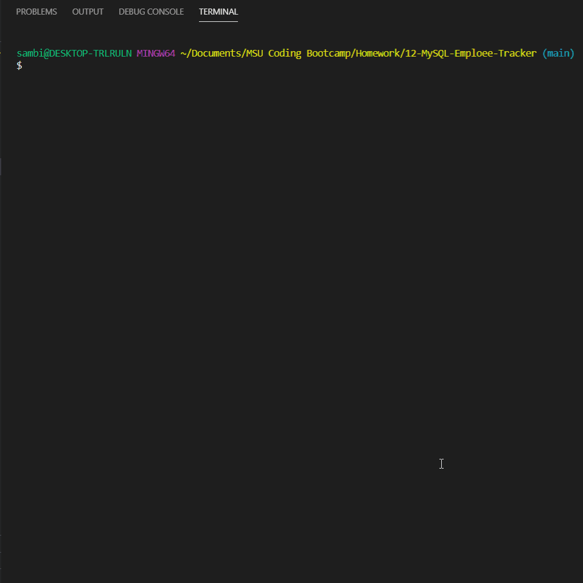

# Employee Tracker  
The goal of this project was to be able to view and interact with a database as a content management system using Node, Inquirer, and MySQL. The use case is an employee management system.  

<p align="center">
    
</p>

## Table of Contents:
* [Installation](#installation)
* [Usage](#usage)
* [License](#license)
* [Contributing](#contributing)
* [Tests](#tests)
* [Questions](#questions)
### Installation:
In order to install the necessary dependencies, open the console and run the following:
```npm install```
### Usage:
Please note department, role, and employee ID's when creating, updating, and deleting these items. 
### License:
This project is licensed under:
None
### Contributing:
None
### Tests:
In order to test open the console and run the following:
```npm test```
### Questions:
If you have any questions contact me on [GitHub](https://github.com/sambishop3015) or contact 
Sam Bishop at sambishop3015@hotmail.com

        
